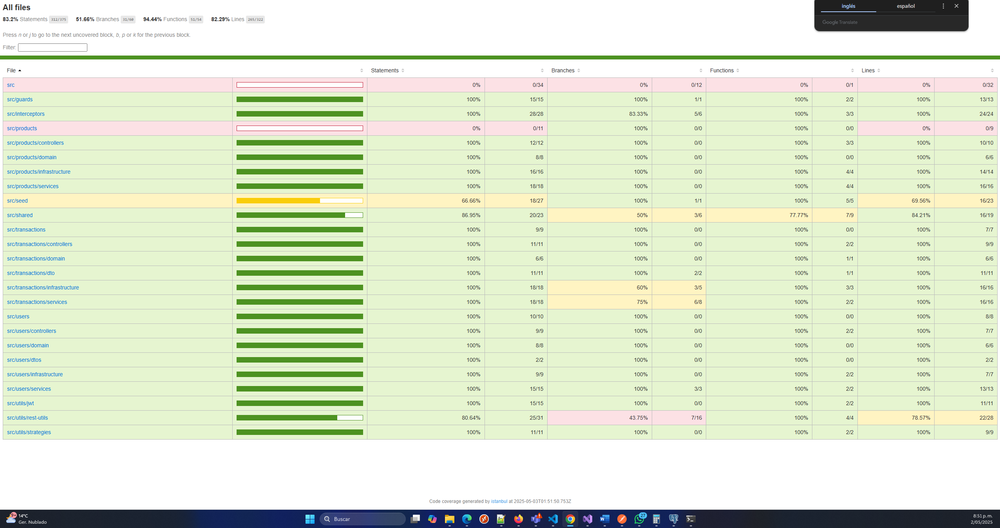

# 💳 Aplicación de Pasarela de Pagos - Prueba Técnica

Este proyecto corresponde a una **prueba técnica** que consiste en desarrollar una aplicación de pago con tarjeta de crédito utilizando la API de **Wompi** (modo sandbox), siguiendo una arquitectura moderna, buenas prácticas de seguridad y despliegue en la nube.

---

## 📱 Frontend - SPA (React)

### Requisitos

- Aplicación de una sola página (**SPA**) construida en **ReactJS** (no se permiten otros frameworks).
- **Diseño mobile-first**, adaptable a múltiples tamaños de pantalla (mínimo: iPhone SE 2020 – 1334 x 750 px).
- Manejo del estado con **Redux** siguiendo la arquitectura Flux.
- Interfaz de usuario desarrollada libremente, usando **Flexbox o Grid** para maquetado.
- Almacenamiento seguro de la transacción en el **estado de la aplicación o localStorage**.
- Uso de **Jest** para pruebas unitarias con cobertura superior al **80%**.

---

## 🧠 Backend - API (NestJS)

### Requisitos

- API construida en **NestJS** (no se permite Ruby on Rails ni otros frameworks).
- Lógica de negocio separada del controlador/routing.
- Se sigue la **Arquitectura Hexagonal** con el patrón de **Ports & Adapters**.
- Uso del enfoque **ROP (Railway Oriented Programming)** en los casos de uso.
- Base de datos **PostgreSQL**.
- ORM: **Prisma**.
- Base de datos precargada con productos ficticios (**no se necesita endpoint para crear productos**).
- Pruebas unitarias con **Jest** y cobertura superior al **80%**.

---

## 🧪 Resultados de Cobertura

La siguiente imagen muestra el porcentaje de cobertura de las pruebas unitarias en el proyecto:



### Frontend

```bash
# Ejecutar pruebas y generar reporte
npm run test:coverage
```

### Backend

```bash
# Ejecutar pruebas y generar reporte
npm run test:cov
```

- ✅ **Cobertura total:** >80% en ambos entornos.

---

## ☁️ Despliegue en la Nube

El proyecto fue desplegado usando **AWS** aprovechando el free-tier.

- 🔗 **Frontend desplegado:** [https://apptransactions.netlify.app/](https://apptransactions.netlify.app/)  
- 🔗 **API Backend desplegada:** [https://fullstackreactnext.onrender.com/api](https://fullstackreactnext.onrender.com/api)

---

## 🔐 Seguridad

- Autenticación básica con token JWT.
- Buenas prácticas de OWASP: uso de HTTPS, headers de seguridad y validaciones.
- Los datos de pago solo se procesan vía **sandbox** usando Wompi.

---

## 📦 Modelo de Datos

Tabla: **Products**

| Campo       | Tipo      | Descripción                    |
|-------------|-----------|--------------------------------|
| id          | UUID      | Identificador único            |
| name        | String    | Nombre del producto            |
| price_cents | Integer   | Precio en centavos COP         |
| currency    | String    | Moneda (ej: COP)               |
| image_url   | String    | URL de la imagen               |
| description | Text      | Descripción opcional           |

---

## 💳 Wompi - Datos de Prueba

> Todos los pagos se realizan en **modo sandbox**, sin dinero real.

- 🔐 API Key Pública: `pub_stagtest_g2u0HQd3ZMh05hsSgTS2lUV8t3s4mOt7`  
- 🔐 API Key Privada: `prv_stagtest_5i0ZGIGiFcDQifYsXxvsny7Y37tKqFWg`
- 🔐 URL API Sandbox: `https://api-sandbox.co.uat.wompi.dev/v1`

Documentación oficial:
- [Inicio Rápido Wompi](https://docs.wompi.co/docs/colombia/inicio-rapido/)
- [Ambientes y llaves](https://docs.wompi.co/docs/colombia/ambientes-y-llaves/)

---

## 🧩 Arquitectura y Organización

```
/frontend
  ├── components
  ├── screens
  ├── redux
  ├── services
  └── utils

/backend
  ├── src
      ├── domain
      ├── application
      ├── infrastructure
      ├── controllers
      └── main.ts
```

---

## ✅ Entregables

- ✔ SPA completamente funcional con flujo de pago.
- ✔ Backend conectado y desplegado.
- ✔ Cobertura de pruebas > 80% (Frontend + Backend).
- ✔ Proyecto disponible públicamente en GitHub (sin incluir “Wompi” en el nombre).
- ✔ Documento README completo en español.

---

## 📌 Recomendaciones cumplidas

- [x] Arquitectura Hexagonal
- [x] Patrón Ports & Adapters
- [x] Seguridad (OWASP, JWT, HTTPS)
- [x] Responsive Design
- [x] Despliegue en AWS / Render
- [x] Cobertura de pruebas
- [x] Clean Code y organización modular

---

## 🏁 Cómo ejecutar localmente

### Frontend

```bash
cd frontend
npm install
npm run dev
```

### Backend

```bash
cd backend
npm install
npx prisma generate
npx prisma migrate dev --name init
npm run start:dev
```

